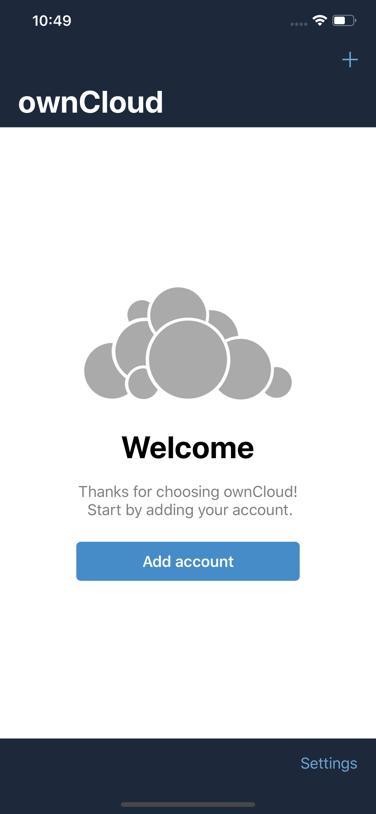
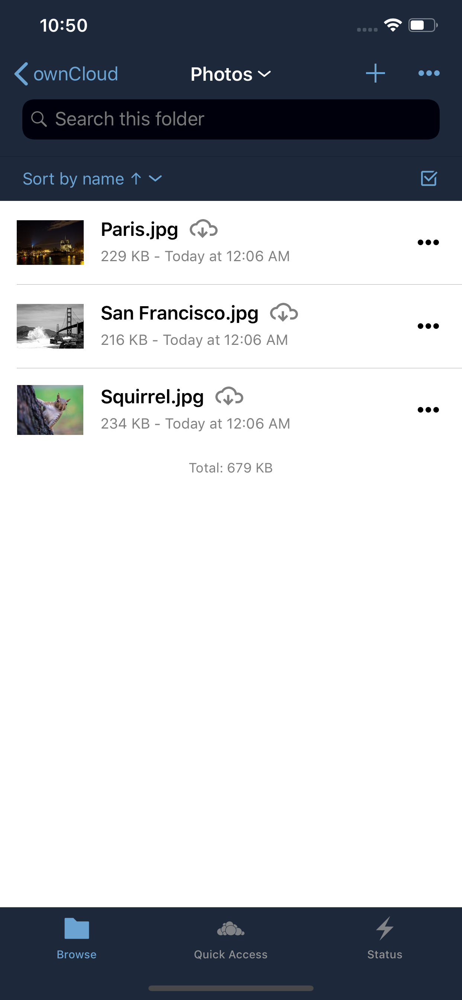
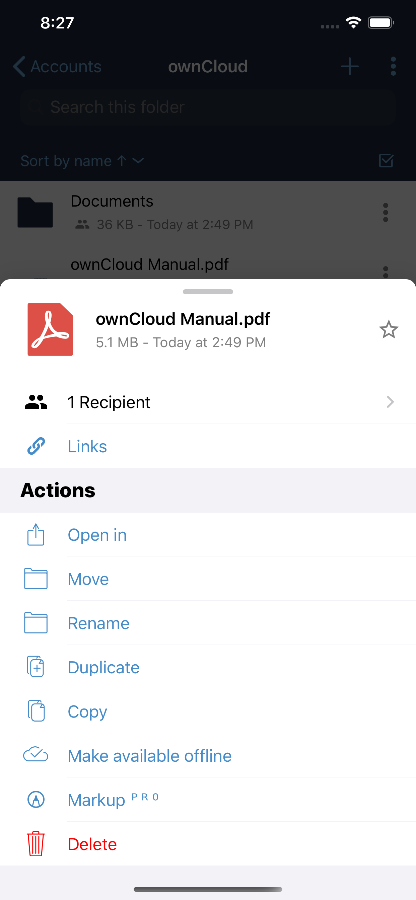
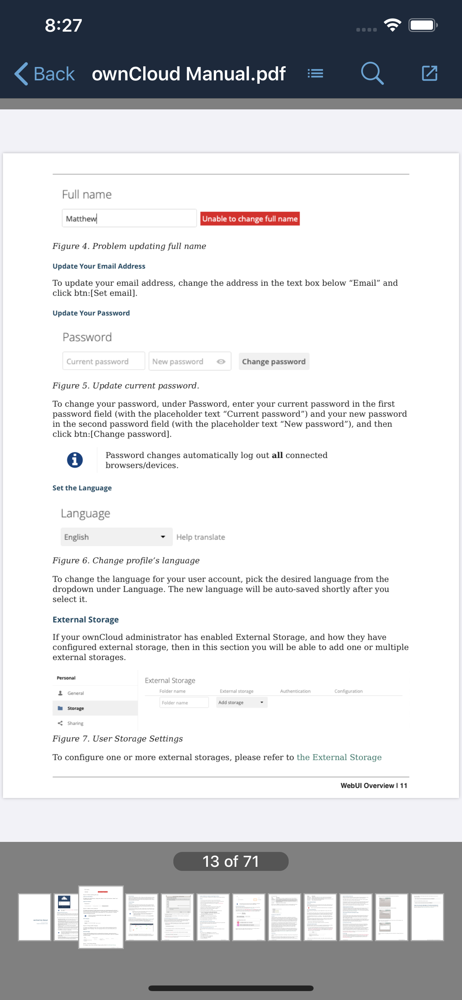
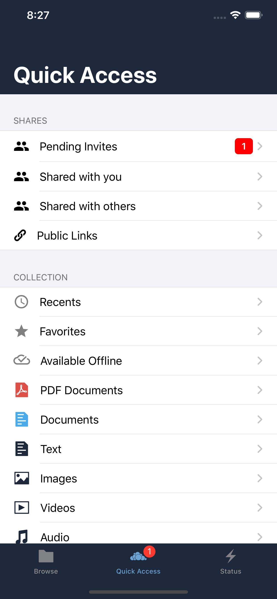
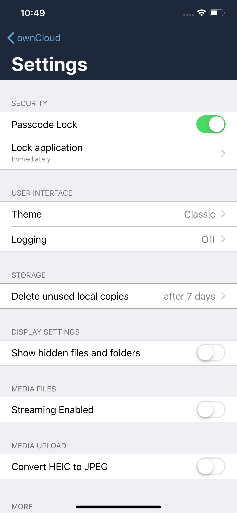

# [ownCloud](https://owncloud.org) iOS App

## 📱 The new iOS app for your ownCloud!

####  🌎 https://ownCloud.com

| Account List                                                 | File List                                                    | File Actions                                                 | Preview Files                                                | Quick Access                                                 | Settings                                                     |
| ------------------------------------------------------------ | ------------------------------------------------------------ | ------------------------------------------------------------ | ------------------------------------------------------------ | ------------------------------------------------------------ | ------------------------------------------------------------ |
|  |  |  |  |  |  |

## 😍 Features

* 🦋 Using the current iOS frameworks
* ⭐️ Exclusively built for iOS
* 🛠 Written in Swift
* 📂 Seamless integration with iOS files for improved collaboration
* 🕹 Multi-select with drag and drop features for efficient file management
* 👑 Using iPadOS features for pro users
* ✅ Certificate management and password manager integration for boosting security
* 🚢 Free on the AppStore
* 🇪🇺 Localised in many languages
* 📱iOS 11+
* 🧩 License: [GPLv3](https://github.com/owncloud/ios-app/LICENSE)

## 📲 Download

Our iOS app is free for downloading available on the AppStore

[](https://apps.apple.com/app/id1359583808)

## 🛠 Build our App

To build our app, please read our [SETUP.md](https://github.com/owncloud/ios-app/blob/master/SETUP.md)

```
$ read [SETUP.md]()
```

## 🇪🇺 Translate

The App is translated in many languages. If your language is missing or if you want to improve a string, you are welcome!
This can be done in [Transifex](https://www.transifex.com/signup/?join_project=owncloud).


## 💡 Found a bug or have some ideas for improvement?

- 💬 Open a new issue on [Github](https://github.com/owncloud/ios-app/issues/new) or [chat](https://talk.owncloud.com/) with us
- 🐥 Don't forget to follow us on [Twitter](https://twitter.com/owncloud) 

## 📋 Start contributing

Make sure you read [SETUP.md](https://github.com/owncloud/ios-app/blob/master/SETUP.md) when you start working on this project. Basically: Fork this repository and contribute back using pull requests to the master branch.
Easy starting points are also reviewing [pull requests](https://github.com/owncloud/ios-app/pulls) and working on [good first issue](https://github.com/owncloud/ios-app/labels/good%20first%20issue).

## ☁️ ownCloud Server

[Learn](https://owncloud.org/news/how-to-set-up-an-owncloud-in-3-minutes/), how you can easily setup your own ownCloud server in 3 minutes or test our ownCloud iOS app with our demo server:

- [Download](https://apps.apple.com/app/id1359583808) our iOS App
- Add account 

### Demo credentials

| Server URL | demo.owncloud.com |
| ---------- | ----------------- |
| User       | demo              |
| Password   | demo              |

